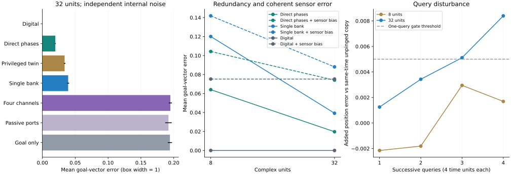

# A single noisy bank can answer a ping; the limited-port gate fails

7 October 2026. [Protocol fixed before outcomes](PING_PROTOCOL.md).
[Runner](research/check_ping.py), [receipt](results/ping_checks.json).

**An uncoupled phase bank answers a goal-vector query using measurements from
one bank, with error 0.0392 in a box of width 1. Directly reading the same
unit outputs is more accurate and cheaper. Four summed output channels fail
to provide a useful query advantage, and query-time vortex coupling hurts.**



This follows Antti's entorhinal question and
[VMNClaude Gate 4](https://github.com/anttiluode/VMNClaude/blob/main/GATE4.md).
Claude's experiment compares a kicked bank with an un-kicked copy that shares
exactly the same future noise. That is a useful causal diagnostic, but such a
copy is not available from a single physical bank. Our main listener compares
measured outputs with that bank's own pre-pulse outputs; future noise remains.
The shared-noise twin is reported separately. This is not a numerical
replication: bank size, kernel, flow integration, corpus and reader selection
differ. No changes were made to VMNClaude.

## 1. What the oscillator stores and how a goal interrogates it

Use an isochronous Stuart–Landau unit in its resting frame:

$$
\dot z_k=\left(\mu+i\mathbf{k}_k^\top\mathbf{v}(t)\right)z_k-|z_k|^2z_k,
\qquad \mu=0.5.
$$

The radial equation attracts to radius $\sqrt{\mu}$, while

$$
\theta_k(t)-\theta_k(0)=\mathbf{k}_k^\top\int_0^t\mathbf{v}(s)\,ds.
$$

Phase stores an accumulated coordinate. It does not uniquely record the
trajectory that produced it. This new velocity input mode is separate from
our earlier additive-input delayed-memory experiments; those failed gates
have not been overturned.

At a stopped endpoint, a goal $g$ specifies the pulse

$$
z_k^+=z_k^-+a\sqrt{\mu}\,e^{i\mathbf{k}_k^\top g}.
$$

For pre-pulse state $z_k^-=r_ke^{i\theta_k}$ and
$\alpha_k=\mathbf{k}_k^\top g-\theta_k$, the immediate phase change is exactly

$$
\Delta\theta_k=\operatorname{atan2}\left(a\sqrt{\mu}\sin\alpha_k,
r_k+a\sqrt{\mu}\cos\alpha_k\right).
$$

At small amplitude and near the cycle it is approximately
$a\sin\alpha_k$. With exact phase integration, $\alpha_k$ encodes the goal
displacement. Noise and finite pulses change that relation; the experiment
evolves the actual state and measures it at 1, 2 and 4 time units.

The isolated deterministic flow is integrated exactly between additive noise
kicks. Query-time coupling uses RK4 on the full nonlinear vector field.
The query is not an exponential of a frozen Jacobian. The optional coupling
is VMN's fixed, smoothed vortex tangent, normalized to spectral norm one,
with positive circulations and smoothing 0.15. It is a designed interaction,
not a fluid solver. Its query-time strength is 0.1; storage remains uncoupled.

## 2. Access contracts and held-out results

Four independent banks, 1024 training / 256 validation / 512 test episodes
each, 200 velocity-input steps, independent internal noise 0.05. Each bank is
trained separately. Training data determine normalization; validation selects
ridge versus kNN and its hyperparameter. Test outcomes select nothing.

Goals lie within radius 0.35 of the true endpoint. A goal alone consequently
conveys some position information. The goal-only control is necessary.

All entries below are mean Euclidean goal-vector error over four banks, at
32 complex units and independent internal noise. The primary pulse is 0.3.

| Readout | Error | What it receives |
|---|---:|---|
| Answer zero displacement | 0.2357 | No observations |
| Goal-only trained control | 0.1942 | The 2D goal |
| Digital integration | below 1e-12 | Start and the same measured velocity |
| Direct-phase reference | **0.0197** | Pre-pulse unit outputs and the known goal pattern |
| Privileged twin diagnostic | 0.0338 | Kicked and un-kicked banks sharing future noise |
| **Single-bank local-port listener** | **0.0392** | Each unit's pre-pulse output and later phase changes |
| Four summed channels, active | 0.1949 | Two complex sums, their changes and the goal |
| Four summed channels, passive | 0.1920 | Identical output channels/times with no pulse, plus the goal |
| Local ports, query-time vortex | 0.0532 | Same local measurements with coupling during the query |
| Local ports, shuffled training/validation targets | 0.2390 | Same features; their target relationship destroyed |

The single-bank listener is about six times better than answering zero, but
almost twice as inaccurate as the direct-phase reference. The small pulse
0.05 has error 0.1474: lowering pulse strength is not free when future noise
is not cancelled.

The successful local listener observes all 32 complex unit outputs. The direct
reference can be computed from those same pre-pulse measurements, so it is an
accessible competitor under this contract, not an unavailable hidden-state
oracle. This experiment gives no reason to prefer pinging when those outputs
can be read directly.

The limited-port experiment is stricter: its reader receives only two complex
weighted sums and their changes, plus the goal. Random fixed sum weights and
the declared readers do not extract a useful response. This is a failed
measurement design at the tested settings, not a proof that every four-channel
or single-port instrument must fail.

| Predeclared gate | Outcome |
|---|---|
| Single-bank query beats half the zero-answer error | **Pass**, improvement on 4/4 banks |
| Physical query within 1.25× direct-phase error | **Fail**, ratio 1.99 |
| Four-channel active query beats passive and goal-only | **Fail** |
| One query adds at most 0.005 mean position error | **Pass**, added error 0.00161 |
| Query-time vortex improves accuracy by at least 10% | **Fail**, worsens it on 4/4 banks |
| 32 units reduce direct-reference error at least 25% vs 8 | **Pass**, 0.0197 vs 0.0641 |

## 3. Query disturbance and the sensor-error limit

Damage is scored with one frozen position reader trained on pre-pulse phases.
Compare the kicked state with an un-kicked copy after the same listening time
and the same noise draws. The twin is used for causal damage measurement,
not supplied to the physical reader.

For 32 units, pre-pulse absolute-position error is 0.0246. After one primary
pulse it is 0.0266. The added error relative to the same-time un-kicked bank
is 0.00161. **This is not an unchanged state:** the causal unit-phase change
is approximately 0.213 radians RMS. The gate bounds a mean decoder error
increase, not every query, every neuron or every future task.

Four successive pulses raise position error to 0.0339 and add 0.00840 relative
to the same-time un-kicked bank. Reading therefore writes to this memory.
The goals also supply correlated spatial information; low or negative added
error in some conditions should not be mistaken for nondestructive access.

Independent internal noise can be reduced by pooling additional unit signals.
Coherent sensor error has a different limit. Add an episode-specific velocity
bias with independent component standard deviation 0.0003; after 200 steps it
coherently translates the encoded position.

| Readout | Independent internal noise | Internal noise plus sensor bias |
|---|---:|---:|
| Direct phases, 8 units | 0.0641 | 0.1043 |
| Direct phases, 32 units | 0.0197 | 0.0741 |
| Single-bank query, 8 units | 0.1201 | 0.1418 |
| Single-bank query, 32 units | 0.0392 | 0.0881 |
| Digital integration | below 1e-12 | 0.0752 |

The digital reference has no analog state noise; it does receive the same
sensor bias. Its perfect result in the first case is intentionally an
arithmetic reference, not a claim about real hardware.

A coherent bias is unidentifiable from the phase code alone: a true endpoint
$x$ with cumulative sensor error $b$ produces the same code as an accurately
integrated endpoint $x+b$. A numerical fixture verifies that equality. Decoder
priors can change average errors, which can explain why direct-phase error is slightly below the biased
digital reference, but no bias detection or correction was demonstrated.

Increasing 8 to 32 units also increases state, measurement channels, feature
count and decoder storage. The improvement is not a fixed-resource efficiency
result or a proof of a particular error-correction scaling law.

## 4. Storage, bandwidth and latency

The successful primary reader is kNN on all four banks. It retains 1024
training feature vectors and their two-component targets. These costs are
shared decoder storage, not per-episode recurrent state.

| Quantity | Single-bank query, 32 units | Direct-phase reference | Digital reference |
|---|---:|---:|---:|
| Retained state | 64 float64 scalars / 512 bytes | Same oscillator state | 2 float64 scalars / 16 bytes |
| Measured real output channels | 64 | 64 | Arithmetic state access |
| Real output samples per query | 256 | 64 | 2 state coordinates |
| Pulse pattern | 64 real values | No pulse | No pulse |
| Readout features | 96 | 64 | Arithmetic subtraction |
| Selected decoder storage incl. normalization | 100,544 float64 scalars / 804,352 bytes | 67,712 / 541,696 bytes | No trained decoder |
| Listening latency | 4 model time units | No listening interval | No listening interval |

The phase code requires 64 static wavevector scalars. Two complex sum ports
add 128 real weight scalars. Optional dense vortex coefficients occupy 4096
real scalars. The privileged twin requires a second bank and consumes 128
real output channels across both banks, with 384 real output samples over
three listening times; it is not a single-bank hardware interface.

kNN prediction scans 1024 stored training vectors; its work scales with
training-set size times feature count. Query preparation computes one complex
drive per unit. The four-channel listener's smaller measurement count did not
translate into a useful query. No ADC precision, physical energy, communication
energy, fabrication cost or hardware timing has been measured. The entire
CPU simulation/readout sweep takes approximately 35 seconds in this environment.

## 5. Meaning and remaining question

This establishes a response-based read of accumulated phase on a single noisy
bank, while closing off two tempting shortcuts: the working listener exposes
all unit outputs, and a compact recurrent state does not imply a compact
decoder. It also verifies that coherent sensor error survives population
redundancy and that repeated querying changes the memory.

The result does not establish novel grid-cell biology or a reason to replace
a digital register. A useful physical-memory interface would need to succeed
under a genuinely restricted observation budget, or show another measured
advantage after including encoding, decoding and disturbance costs. The
four-channel gate provides a concrete failed starting point for that question.

The geometric bridge to [our response note](READER.md) remains valid: stored
phase changes the direction in which an identical perturbation is processed.
Equal singular values can hide that difference. This pulse tests the actual
input/output response; it does not depend on changing the singular-value
spectrum or adding recurrent vortex coupling.

## Reproduce and verification

```bash
python -W error -m unittest discover -s research -p 'test_*.py'
python -W error research/check_ping.py
```

For predictable CPU runtime, set `OPENBLAS_NUM_THREADS=1` and
`OMP_NUM_THREADS=1` before starting Python. `--output-dir PATH` saves a
reproduction separately from the committed receipt.

The full suite has 44 tests. The new tests cover exact phase integration,
radial relaxation, the analytic pulse response, noisy one-bank observations
versus twin cancellation, coherent-error indistinguishability, sum-port access,
actual coupled evolution against an independent ODE solver, split isolation,
reader recovery, deterministic replay and joint gate wins on the same banks.
The receipt records every bank/condition, validation choices, decoder sizes,
cost accounting, predictions/fit hashes, source hashes and software versions.

An independent review reproduced all non-timing fields of the initial receipt
exactly. It caught a gate predicate that counted wins against two controls
separately rather than jointly on the same banks; a failing regression test
was added and the predicate corrected. This did not change the real failed
limited-port outcome. The final receipt was regenerated after that correction.
The previous math, geometry and reader receipts are preserved.
