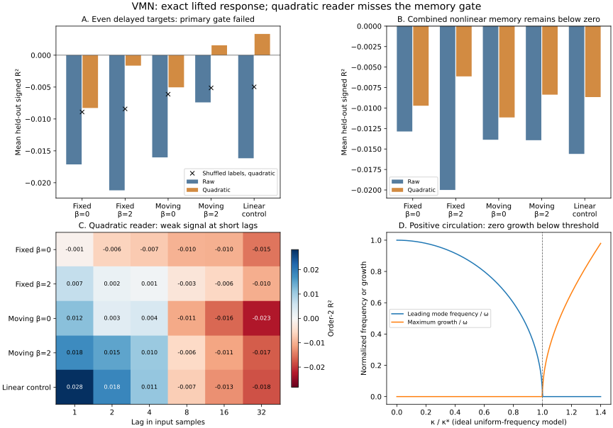

# Adding coordinates: an exact response lift and a failed memory gate

7 October 2026. This follow-up was motivated by Antti's tile/hemisphere examples
and [VMNClaude's doubled view](https://github.com/anttiluode/VMNClaude/blob/main/VMN_NOTE.md#5b-adding-a-dimension).
The [protocol](READER_PROTOCOL.md) was fixed before collecting these outcomes.

**The full smoothed, nonlinear VMN tangent has an exact doubled complex form.
A reader of additional quadratic coordinates removes a known symmetry
obstacle, but misses the predeclared delayed-memory improvement gate.**

The two statements concern different operations. A unitary coordinate change
preserves the response's spectrum, singular values and rank. Adding nonlinear
features to a reader changes which functions of the same state it can express.



## 1. Lift the response around the current state

Let $q=(x_1,y_1,\ldots,x_N,y_N)$ and $z_k=x_k+iy_k$. Any real response matrix
has a unique representation

$$
\delta\dot z=A\,\delta z+B\,\delta\bar z.
$$

For the interleaved real Jacobian, extract its $N\times N$ blocks $J_{xx}$,
$J_{xy}$, $J_{yx}$ and $J_{yy}$. Direct substitution gives

$$
A=\frac{J_{xx}+J_{yy}+i(J_{yx}-J_{xy})}{2},\qquad
B=\frac{J_{xx}-J_{yy}+i(J_{yx}+J_{xy})}{2}.
$$

Consequently

$$
\frac{d}{dt}\begin{pmatrix}\delta z\\\delta\bar z\end{pmatrix}
=D(q)\begin{pmatrix}\delta z\\\delta\bar z\end{pmatrix},\qquad
D(q)=\begin{pmatrix}A(q)&B(q)\\\overline{B(q)}&\overline{A(q)}\end{pmatrix}.
$$

Both coefficient matrices can depend on the actual nonlinear trajectory.
This is its exact tangent, not a globally linear replacement of that trajectory.
The physical perturbations satisfy conjugacy; eight planar units retain 16 real
degrees of freedom.

Normalize the lift: $Tq=(z,\bar z)/\sqrt{2}$. As a matrix on the complexification
of the real state space, $T$ is unitary and

$$
D=TJT^*,\qquad T^*T=I.
$$

For the time-dependent finite-state response, the same constant transformation
gives

$$
\Phi_D(t,s)=T\Phi_J(t,s)T^*,\qquad
\Delta\Phi_D=T\Delta\Phi_JT^*.
$$

Thus the eigenvalues, singular values, spectral/Frobenius norms and exact ranks
are unchanged. The 95%-energy rank of a response update is unchanged too. Merely
rewriting the operator in these coordinates cannot improve its compression.

Across 48 sampled full-model Jacobians, the largest eigenvalue mismatch is
$7.8\times10^{-15}$; the largest singular-value mismatch is
$1.6\times10^{-15}$. An independent integration of the complex tangent agrees
with the real finite-time response for all four geometry/shear variants.

## 2. What rotation, strain and nonlinear neurons contribute

Write $c=a(1+i\beta)$ for the local cubic coefficient. The oscillator is

$$
f_k(z_k)=(\mu-d_k+i\omega_k)z_k-c|z_k|^2z_k.
$$

Its local tangent coefficients are

$$
A_{kk}^{\mathrm{local}}=\mu-d_k+i\omega_k-2c|z_k|^2,
\qquad B_{kk}^{\mathrm{local}}=-cz_k^2.
$$

Rotation appears in the ordinary complex-linear term. Nonlinear amplitude and
orientation affect both terms. In particular, the phase of $z_k^2$ is twice the
oscillator phase: two opposite states have the same local Jacobian, as already
shown in [GEOMETRY.md](GEOMETRY.md#5-shear-gives-phase-memory-with-an-exact-qualification).

The smoothed vortex kernel also contributes both terms. For complex separation
$w$ and $s=|w|^2+\delta^2$, its velocity from circulation $\Gamma$ is

$$
v(w)=\frac{i\Gamma}{2\pi}\frac{w}{s}.
$$

Its exact differential is

$$
\delta v=\frac{i\Gamma}{2\pi s^2}
\left[\delta^2\,\delta w-w^2\,\delta\bar w\right].
$$

Here the scalar $\delta$ denotes smoothing; $\delta w$ denotes a perturbation.
Sum these pair contributions with $\delta w=\delta z_k-\delta z_j$ to obtain
$A_v$ and $B_v$, including their diagonal row-sum terms. At zero smoothing,
$A_v=0$ and the vortex response is purely conjugate-linear. With smoothing
0.15, $A_v$ is nonzero; discarding it changes the model.

The full hybrid's coefficients are

$$
A=\operatorname{diag}(A_{kk}^{\mathrm{local}})+\kappa A_v(p+\eta q),\qquad
B=\operatorname{diag}(B_{kk}^{\mathrm{local}})+\kappa B_v(p+\eta q).
$$

For fixed geometry $\eta=0$, the vortex coefficients are constant; for moving
geometry $\eta=1$, they change with the state. The chain-rule factor cancels the
moving coupling's division by $\eta$, as in the earlier derivation. Additive
input does not contribute to the state Jacobian.

This makes the shared mechanism explicit: a past input changes state, and
nonlinear state changes alter the matrix governing later perturbations.

## 3. The simple onset formula has specific conditions

For equal frequencies, pure conjugate coupling and a common scalar growth term
removed, put

$$
H=\begin{pmatrix}i\omega I&\kappa M\\\kappa\bar M&-i\omega I\end{pmatrix}.
$$

Squaring cancels the off-diagonal blocks exactly:

$$
H^2=\begin{pmatrix}\kappa^2M\bar M-\omega^2I&0\\
0&\kappa^2\bar MM-\omega^2I\end{pmatrix},\qquad
\lambda(H)=\pm\sqrt{\kappa^2\nu-\omega^2},
\quad \nu\in\operatorname{spec}(M\bar M).
$$

For our unsmoothed point-vortex tangent with **positive circulations**, let
$G=\operatorname{diag}(\Gamma_k)$. The matrix $GM$ is complex symmetric, so
$C=G^{1/2}MG^{-1/2}$ is complex symmetric. Then $M\bar M$ is similar to
$C\bar C=CC^*$, which is positive semidefinite. Its eigenvalues are real and
nonnegative. Therefore

$$
\kappa<\kappa_*:=\frac{|\omega|}{\sqrt{\nu_{\max}}}
\quad\Longrightarrow\quad
\max\operatorname{Re}\lambda(H)=0.
$$

Below threshold the coupling changes frequencies, initially at order
$\kappa^2$; it produces no growth-rate shift in this ideal limit. This was
checked at 0.1 and 0.3 times threshold for all four layouts, and the predicted
growth was checked above threshold at 1.2 times threshold. Claude's Gate 1 uses
mixed circulation signs; its complex-$\nu$ weak-coupling onset shifts are a
different case.

Our actual model has nonzero smoothing, unequal frequencies and unequal decay.
Its onset must use the full Jacobian, as the original experiment already does.

There is still a useful rotation rule for a fixed interaction matrix. Under
$z_k=e^{i\omega_kt}w_k$, ordinary coupling gains the factor
$e^{i(\omega_j-\omega_k)t}$, and conjugate coupling gains
$e^{-i(\omega_j+\omega_k)t}$. Opposite rotation senses can make a conjugate
interaction resonant. This does not by itself prove a memory advantage for
the moving, driven nonlinear model.

## 4. The reader lift: local quadratic observables

The additional features are

$$
F(q)=\left[q,\ (|z_k|^2)_k,\ (\operatorname{Re}z_k^2)_k,
\ (\operatorname{Im}z_k^2)_k\right].
$$

They span the three local quadratic monomials at each unit:

$$
x_k^2=\frac{|z_k|^2+\operatorname{Re}z_k^2}{2},\qquad
y_k^2=\frac{|z_k|^2-\operatorname{Re}z_k^2}{2},\qquad
x_ky_k=\frac{\operatorname{Im}z_k^2}{2}.
$$

They are deterministic current-state observables. The recurrent state stays
16-dimensional; the reader receives 40 features instead of 16. With 18 targets
and an intercept, that raises learned coefficients from 306 to 738. Training
normalization additionally stores 32 or 80 mean/scale numbers. All models,
including the linear control, receive the same feature map and readout budget.

For the unforced isolated unit, the area coordinate $u=r^2$ obeys
$\dot u=2\mu u-2au^2$: the familiar logistic substitution. It simplifies the
amplitude equation; it does not make the entire coupled system linear.

In the fixed model, input-history sign reversal reverses the state. Its affine
reader therefore has zero population covariance with the even Legendre order-2
target under the symmetric input distribution. The added even observables remove
that expressivity obstruction. A symmetric synthetic fixture verifies exact
quadratic-target recovery on unseen amplitudes while the affine reader fails.

Removing that obstruction is insufficient evidence that useful delayed history
is available. The real experiment is the next check.

## 5. Fresh-history outcomes at frozen operating points

The 20 operating points are frozen from the earlier validation-selected models;
they are not retuned for the expanded reader. Each model is integrated on fresh
train/validation/test input histories, with the two readers using identical
state arrays. Readout normalization and weights use training data; validation
chooses ridge strength. Test data choose nothing.

The primary gate, fixed geometry with shear 0, requires an order-2 R² gain
at least 0.02, wins on at least 3/4 seeds, and a positive quadratic-reader mean.
It **fails**: gain **0.00885**, wins **2/4**, quadratic-reader mean
**-0.00828**. The four paired gains are 0.01845, 0.02311, -0.00601 and -0.00016.

All entries below average signed held-out R² over four seeds and six lags.

| Frozen model | Raw order-2 R² | Quadratic order-2 R² | Quadratic minus raw | Quadratic mean orders 2/3 R² |
|---|---:|---:|---:|---:|
| Fixed, shear 0 | -0.01712 | -0.00828 | 0.00885 | -0.00972 |
| Fixed, shear 2 | -0.02119 | -0.00164 | 0.01955 | -0.00614 |
| Moving, shear 0 | -0.01603 | -0.00504 | 0.01098 | -0.01115 |
| Moving, shear 2 | -0.00740 | 0.00155 | 0.00895 | -0.00837 |
| Linear control | -0.01616 | 0.00333 | 0.01949 | -0.00866 |

Some short-lag order-2 targets become weakly readable. The linear control has
the highest mean order-2 score and the highest order-1 score with either reader.
The mean orders-2/3 score remains negative for every model. This follow-up
therefore demonstrates no useful aggregate nonlinear-memory advantage.

With the same quadratic-reader budgets, moving-minus-fixed geometry at shear 2
has mean nonlinear R² difference -0.00223, wins 2/4. Shear gains are 0.00358
(fixed, wins 4/4) and 0.00278 (moving, wins 2/4). Those gates fail, as do all four
nonlinear-model comparisons against the linear control.

Shuffling training and validation target rows independently destroys their
state relationship. The quadratic controls' mean order-2 R² ranges from -0.00891
to -0.00497 across models; the complete receipt records every target score.
The actual linear control's small positive quadratic signal is consistent with
nonlinearity supplied by the reader of a linear memory system.

These results are conditional on the earlier operating points and this local
feature map. They do not establish that every nonlinear distinction has been
lost: cross-unit products are absent, and a more capable reader could extract
different functions. The failed gate and the earlier response-reconstruction
results remain separate findings.

## Reproduce

```bash
python -m unittest discover -s research -p 'test_*.py'
python research/check_reader.py
```

The runner performs 13 numerical consistency checks, the 20 matched model runs,
40 ordinary reader fits and 40 shuffled-control fits, each with validation ridge
selection, and writes [the complete receipt](results/reader_checks.json) and
[the figure](results/reader_summary.svg). The receipt includes source hashes,
the frozen-model receipt hash, RNG seeds, model offsets, per-target scores,
training normalization and fit-parameter hashes. Its 48-Jacobian checks and
finite-response integration verify the derivation separately from task scores.

Code: [complex tangent](research/geometry_lift.py),
[readers and paired experiment](research/geometry_reader.py),
[runner](research/check_reader.py). The doubled representation is standard real
linear algebra in complex coordinates; no mathematical-novelty claim is made.
