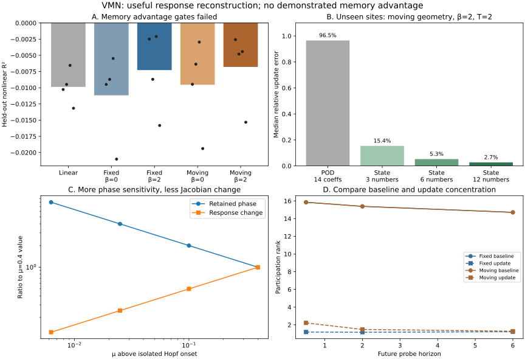

# VMN — Vortex, Matrix, Neuron

**A mathematical investigation of how a small dynamical state changes the response of a larger machine.**

The motivating question is: can an earlier input change the *operator through which the next input is processed*, and can that change be retained cheaply?

The bridge is the tangent matrix of nonlinear dynamics:

$$
\dot x=f(x)+Bu,\qquad
J(x)=D_x f(x),\qquad
\delta\dot x=J(x(t))\delta x+B\delta u.
$$

A past event changes the current state $x$. If that changes $J$, the same later pulse has a different response. Vortices, nonlinear neural activity and oscillators give different concrete realizations of this structure.

This repository contains **derivations, reproducible numerical research probes and a small reservoir experiment with trained affine readouts**. A learned recurrent vortex layer, a cylinder-wake solver and competitive ML benchmarks remain future work.

- [Mathematical derivations, proofs and falsifiers](MATH.md)
- [Runnable numerical checks](research/check_math.py)
- [Machine-readable receipt](results/math_checks.json)
- [New geometry and shear results](GEOMETRY.md)
- [Protocol fixed before measuring outcomes](GEOMETRY_PROTOCOL.md)
- [New runnable gate](research/check_geometry.py) and [complete receipt](results/geometry_checks.json)
- [Doubled response and quadratic-reader follow-up](READER.md)
- [Reader protocol](READER_PROTOCOL.md), [runner](research/check_reader.py) and [receipt](results/reader_checks.json)


## Geometry and shear gate — 7 October 2026

The new experiment compares eight planar oscillators with fixed versus moving
vortex coupling, with shear on and off. Their state sizes, inputs and rest
linearizations match. A trained readout predicts delayed past inputs on
independent test trajectories; a separate probe tests response reconstruction
at event locations excluded from dictionary training.

| Result | Finding |
|---|---|
| Moving geometry's nonlinear-memory advantage | **Failed** the predeclared gate; mean R² gain 0.00050, wins 2/4 |
| Shear's nonlinear-memory advantage | **Failed** in both geometries; gains 0.00390 and 0.00276 |
| All selected models' mean nonlinear test R² | **Below zero** |
| Unseen-site response-update reconstruction, moving geometry + shear, horizon 2 | fixed POD oracle **96.5% error**; six-number state code **5.3% error** |
| Same six-number code, independent later probe directions | median relative probe-response update error **9.6%** |
| Isolated shear oscillator nearer Hopf | retained phase grows **8×**, relaxed Jacobian change shrinks **8×** |

The reconstruction also succeeds with fixed geometry. Its useful ingredient is
**retaining state and regenerating the response from known equations**; the
test does not establish that moving vortices improve task memory. The sparse
code requires a shared baseline and model, reads the full state to encode, and
performs a full variational ODE solve to decode. No overall storage or speed
advantage is established.

The [new note](GEOMETRY.md) derives the exact phase-kick formula and explains
these distinctions. **24/24 new numerical checks and 16 focused unit tests
pass**, alongside the original 63 consistency checks.



## Adding coordinates: response and reader follow-up

The full smoothed, nonlinear response has an exact doubled complex form on
`(δz, δz̄)`. A normalized unitary lift preserves its spectrum, singular values
and ranks; the largest eigenvalue mismatch across 48 sampled Jacobians is
**7.8 × 10⁻¹⁵**. Smoothing and oscillator nonlinearity contribute both ordinary
and conjugate coupling, so a pure-vortex onset formula needs extra conditions.

A second experiment gives every model the same quadratic current-state
observables. The recurrent state stays at 16 real coordinates; readout features
increase from 16 to 40. Model operating points are frozen, and fresh histories
are held out. The primary even-target reader gate **fails**: mean order-2 R² gain
**0.00885**, wins **2/4**, expanded-reader mean **-0.00828**. The added features
remove a symmetry obstruction, but do not establish useful aggregate nonlinear
memory. The expanded linear control also has weak short-lag quadratic signal.

The [follow-up note](READER.md) contains the exact coefficients, ideal-limit
qualification, costs and full results. **13/13 additional numerical checks and
29 total unit tests pass.** The earlier geometry receipts remain unchanged.

## What the mathematics established

1. **Nonlinearity enables history to change the next response operator.** A fixed linear system with additive inputs and a linear observation retains history in its state, but its probe-response operator is independent of that history.
2. **Oscillation supplies amplitude and phase.** In a Hopf normal form, radial perturbations decay while phase perturbations can persist. The orientation of the current state changes which directions are suppressed by the nonlinear response.
3. **A small controlling state does not imply a low-rank matrix change.** Moving one of $N$ ordinary point vortices generically changes the instantaneous Jacobian at rank $2N-2$. Its description can still be short: a shared baseline, a vortex index and two displacement coordinates.
4. **Hopf onset does not guarantee low-rank updates.** An explicit 34-dimensional counterexample has one critical Hopf pair, but an operator update requiring 32 modes for 95% of its energy. Three shared matrix coefficients nevertheless describe that update exactly. Low rank and a compact operator codebook are different kinds of compression.

The elementary proofs are included in [MATH.md](MATH.md). Their research novelty has not been assessed.

## Fresh numerical evidence — 7 October 2026

| Check or experiment | Result |
|---|---:|
| Numerical consistency checks | **63 / 63 pass** |
| Analytic point-vortex Jacobian vs central differences | relative error **7.19 × 10⁻¹¹** |
| One-vortex instantaneous write, $N=16$, 30 predefined events | rank **30 / 32** in every case |
| Finite response baseline, eight vortices, all 16 position probes | **15 modes** for 95% energy |
| Finite response update, 32 predefined events | median **5 modes**, range **3–8** |
| Update norm / baseline norm in that scan | median **0.736%** |
| Shared update dictionary: 20 training events at five sites | **8 basis components** for 95% training energy |
| Same dictionary, 12 events at three unseen sites | median relative reconstruction error **93.9%** |
| Hopf counterexample at onset | update rank **34**, 95%-energy rank **32** |
| Same Hopf update, shared analytic matrix dictionary | **3 coefficients**, exact reconstruction |

The original point-vortex dictionary test is an **optimistic reconstruction bound**: coefficients are obtained by projecting the true held-out operator. No coefficient predictor was trained. Its poor transfer shows that individually compact updates need not share a transferable fixed basis. The newer [state-code test](GEOMETRY.md) evaluates a structural decoder in a separate designed hybrid model.

These are ideal point-vortex and normal-form experiments, with fixed circulations, noiseless observations and finite horizons. The median vortex effect is small but well above the derivative-check error. This does not establish task utility, persistent learning or reduced total storage.

## The cylinder paper and the Hopf hypothesis

Goto, Nakajima and Notsu's [2020 preprint](https://arxiv.org/abs/2001.08502), later published as [*Twin vortex computer in fluid flow*](https://doi.org/10.1088/1367-2630/ac024d), reports the best performance in its setup **just below vortex-shedding onset**, around $Re=40$ with onset around $45$. Synchronization deteriorates after shedding begins. It does not measure the rank or compressibility of response updates.

Ordinary free point vortices are inviscid Hamiltonian dynamics. They have no Reynolds-number control and cannot reproduce that dissipative transition. VMN therefore keeps the two models separate: point vortices test response geometry; a dissipative Hopf normal form tests the onset argument.

The useful research target is **a compact state or codebook that predicts changes in future responses**, with generalization and decoder cost measured explicitly. A claim that compactness peaks near onset still needs a driven, higher-dimensional experiment.

## Reproduce

Checked with Python 3.12.14 and the versions in `requirements.txt`:

```bash
python -m pip install -r requirements.txt
python -m unittest discover -s research -p 'test_*.py'
python research/check_math.py
python research/check_geometry.py
python research/check_reader.py
```

The scripts regenerate their respective JSON receipts and SVG figures, print
concise summaries, and exit nonzero if a numerical consistency check fails.
The geometry gate performs 92 small reservoir configurations across four
paired seeds and the separate response-transfer experiment. A failed research
hypothesis is recorded as a finding, rather than treated as a software failure.

Related work: [Kompressori](https://github.com/anttiluode/Kompressori) measures compact finite-response changes in a different nonlinear field. Its five-row local bound does not transfer to globally coupled point vortices.

License: [MIT](LICENSE).
