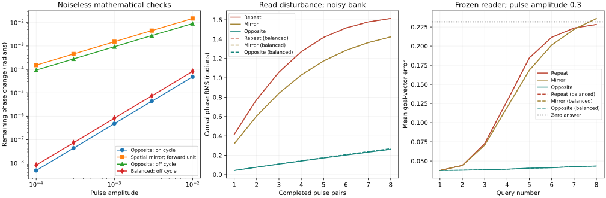

# A counterpulse preserves repeated queries; spatial mirroring does not

7 October 2026. [Frozen protocol](RESTORE_PROTOCOL.md),
[runner](research/check_restore.py), [full receipt](results/restore_checks.json).

**A goal pulse followed by its electrically sign-reversed waveform permits
eight useful reads of a noisy phase bank. At matched pair energy and elapsed
time, it leaves about six times less causal phase disturbance than repeating
the same pulse. Spatially mirrored goals do not provide the same cancellation.**

The first goal-vector error is **0.0376**; the eighth is **0.0434**, compared with
**0.2317** for answering zero. Added position error after eight pairs is
**0.00376**. The joint predeclared useful-read gate passes on **3/4 banks**, not
every bank. This is a controlled oscillator simulation, not a hardware or
neuroscience discovery. The working listener still observes all unit outputs;
four aggregate channels fail their query gate.



## 1. What is being restored

Reuse [PING.md](PING.md)'s uncoupled, isochronous Stuart–Landau units in their
resting frame. Stored phase integrates velocity. While standing still,

$$
\dot z=(\mu-|z|^2)z,\qquad \mu=0.5,\qquad R=\sqrt{\mu}.
$$

An input pulse is a complex displacement, not a multiplication of the state.
For the goal phase $\phi$, apply $q=aR e^{i\phi}$, listen to outputs at
times 1, 2, 4, apply the second pulse at time 4, then let the bank evolve to 8.
The goal-vector reader uses the first listening window only. The second pulse
cannot change an answer already collected.

For an on-cycle initial state $z=R e^{i\theta}$, set
$\alpha=\phi-\theta$. The first pulse changes phase by

$$
\Delta\theta_1=\arg(1+a e^{i\alpha})
=a\sin\alpha-a^2\sin\alpha\cos\alpha+O(a^3).
$$

During a noiseless waiting interval $T$, phase is unchanged and a small
radial displacement decays by $h=e^{-2\mu T}$. A second pulse **$-q$**
then leaves

$$
\Delta\theta_{\mathrm{pair}}
=-(1-e^{-2\mu T})a^2\sin\alpha\cos\alpha+O(a^3).
$$

The first-order phase shifts cancel. The remainder generally does not.
With $T=4$, the measured log-log slopes are **2.0001–2.0017** for three
predeclared phases. The leading coefficients agree with the formula to relative
error below **0.00009** at amplitude 0.0001. These checks concern noiseless
small pulses, not an exact quadratic law for the noisy benchmark.

## 2. Why mirrored targets are different

Spatially mirrored targets at 30 degrees left and right both have the same
forward coordinate. A unit with wavevector $(1,0)$ therefore receives identical
goal waveforms. If their forward projection is $\cos(\pi/6)$, the pair leaves

$$
\Delta\theta_{\mathrm{mirror}}
=2a\sin(\cos(\pi/6))+O(a^2),
$$

with nonzero first-order coefficient **1.52352**. The measured slope is
**0.9981**, not 2. This counterexample rules out automatic cancellation by
spatial left/right mirroring. It does not rule out specially designed circuits
which transform mirrored inputs into opposite phase disturbances.

In the task sweep, the mirror control uses the supplied goal reflected across
the fixed external line **y=0.5**. It does not use the unknown true position to
construct its second target, and does not reproduce the rat's exact sweep
geometry. Electrical sign reversal uses the known first waveform alone.

## 3. Noisy amplitudes and an observable adjustment

Starting off the cycle, let the initial radius be $r_0$ and its noiseless
unqueried radius after the waiting interval be $r_T$. Equal opposite pulse
magnitudes now leave a first-order term:

$$
\Delta\theta_{\mathrm{pair}}
=aR\left(\frac{1}{r_0}-\frac{1}{r_T}\right)\sin\alpha+O(a^2).
$$

A controller can remove that term without knowing the stored phase: use the
measured local magnitude to predict $r_T$ from the known radial equation,
and multiply the second pulse by $c=r_T/r_0$. Both pulses are normalized
so their total squared-magnitude budget equals the fixed family's budget.
For $N$ units the normalization is

$$
\eta=\sqrt{\frac{N+\sum_k c_k^2}{2N}},\qquad
q_{1k}=\frac{aR}{\eta}e^{i\phi_k},\qquad q_{2k}=-c_k q_{1k}.
$$

This radial-balance controller uses **observed magnitudes and the model**,
not a hidden phase, future noise or counterfactual twin. Its off-cycle noiseless
amplitude slope is **2.0008**; the unadjusted controller's is **0.9954**.
Future random perturbations are not reversed. At the tested noise level, this
adjustment does not improve the main aggregate result over simple sign reversal.

## 4. Held-out repeated-read results

32 complex units; four new banks; 1024 train / 256 validation / 512 test episodes
per bank; 200 velocity steps with independent internal noise 0.05. Query noise
is also 0.05 in the primary comparison; pulse amplitude is 0.3. Every endpoint
receives eight queries about the same supplied goal. The intended answer is
always the goal minus the original stored position.

Normalization comes from training. Validation selects ridge versus kNN and
its hyperparameter. The reader is frozen for all subsequent test queries.
An unqueried copy with identical noise is used **only to score causal damage**;
none of its outputs reach the listener. All sources and split hashes are in
the receipt. Existing PING sources and receipts are unchanged.

Means across four banks, after eight pairs:

| Controller / second pulse | Eighth-query error | Added position error | Causal phase RMS |
|---|---:|---:|---:|
| Fixed, repeat same waveform | 0.22829 | 0.26229 | 1.61361 rad |
| Fixed, spatial mirror | 0.23605 | 0.29979 | 1.42261 rad |
| **Fixed, sign-reversed waveform** | **0.04341** | **0.00376** | **0.26167 rad** |
| Balanced, repeat same waveform | 0.22822 | 0.26245 | 1.61376 rad |
| Balanced, spatial mirror | 0.23612 | 0.30119 | 1.42320 rad |
| Balanced, sign-reversed waveform | 0.04332 | 0.00411 | 0.26877 rad |
| Single pulse, fixed; half the pair energy | 0.16042 | 0.23378 | 1.28436 rad |

The repeat and mirror patterns have the same pair energy and elapsed time as
the compensating patterns. Their second pulse is a control intervention, not
an extra scored query. The single-pulse row is an unmatched-energy diagnostic,
with the same elapsed time. Compensation doubles pulse count and energy versus
that diagnostic; it is not a free improvement.

After eight fixed opposite pairs, absolute position error is **0.03286**, versus
**0.02910** for the same-time unqueried bank. The phase difference is still
**0.26167 radians RMS**. Low position error does not mean the entire state has
been restored. Slightly negative added position error after the first pair is
also not proof of nondestructive reading: it is a mean frozen-decoder metric.

| Predeclared gate | Result |
|---|---|
| Ideal opposite-pair quadratic residual | **Pass** |
| Spatial mirror retains first-order term in forward unit | **Pass** |
| Fixed opposite pulses halve eight-pair phase disturbance | **Pass**, 4/4 banks; ratio 0.1622 |
| Balanced opposite pulses halve phase disturbance | **Pass**, 4/4 banks; ratio 0.1666 |
| Fixed controller preserves useful repeated reads | **Pass**, joint requirements 3/4 banks |
| Balanced controller preserves useful repeated reads | **Pass**, joint requirements 3/4 banks |
| Four-channel useful query | **Fail**, joint wins 1/4 banks |

The failed bank in each useful-read gate misses the bound on added position
error (0.00601 for the fixed controller, above 0.005). No amplitude, horizon or reader is selected from test
outcomes to replace it. All declared amplitudes, both noise levels and every
intermediate query are included in the receipt.

For sign-reversed pairs, the complete declared amplitude/noise grid at query 8
is below. Storage noise stays at 0.05 even when query noise is zero. A weaker
pulse reduces disturbance but also loses query accuracy when noise remains.

| Family | Query noise | Amplitude | Query error | Phase RMS | Added position error |
|---|---:|---:|---:|---:|---:|
| Fixed | 0 | 0.05 | 0.03275 | 0.00697 | -0.00001 |
| Fixed | 0 | 0.15 | 0.03249 | 0.06268 | 0.00041 |
| Fixed | 0 | 0.30 | 0.03341 | 0.25626 | 0.00231 |
| Fixed | 0.05 | 0.05 | 0.15197 | 0.01438 | -0.00016 |
| Fixed | 0.05 | 0.15 | 0.06618 | 0.07213 | 0.00016 |
| Fixed | 0.05 | 0.30 | 0.04341 | 0.26167 | 0.00376 |
| Balanced | 0 | 0.05 | 0.03272 | 0.00696 | -0.00002 |
| Balanced | 0 | 0.15 | 0.03256 | 0.06373 | 0.00042 |
| Balanced | 0 | 0.30 | 0.03367 | 0.26190 | 0.00238 |
| Balanced | 0.05 | 0.05 | 0.15205 | 0.01394 | -0.00004 |
| Balanced | 0.05 | 0.15 | 0.06609 | 0.07283 | 0.00011 |
| Balanced | 0.05 | 0.30 | 0.04332 | 0.26877 | 0.00411 |

## 5. The interface and total costs remain the limit

The new-bank direct-phase reference has goal-vector error **0.01917** before
the first query; the physical first-query error is **0.03756**. Both have access
to the same unit outputs. Direct reading remains an accessible competitor.
The four-channel active error is **0.19310**, passive **0.19396**, goal-only
**0.19221**. A shuffled-target local reader gives **0.24052**. Adding a later
counterpulse cannot improve an answer already collected through those channels.

| Cost | Fixed compensating query | Radial-balanced query |
|---|---:|---:|
| Retained oscillator state | 64 scalars / 512 bytes | Same |
| Real measured output channels | 64 | 64 |
| Real output samples per answer | 256 | 256 |
| Readout features | 96 | 96 |
| Selected query decoder, every bank | 804,352 bytes, kNN | Same |
| Pulse waveform values delivered | 2 × 64 real values | 2 × 64 real values |
| Answer available | Time 4 | Time 4 |
| Pair complete; next query allowed | Time 8 | Time 8 |
| Pair pulse-energy proxy | 2.88 | 2.88 |
| Eight pairs: proxy / elapsed time | 23.04 / 64 | Same |

Time is in model units, not seconds. Pulse energy is the sum of squared complex
pulse magnitudes, not measured joules. Fixed compensation reuses the first
waveform with a sign flip; balanced compensation also needs 32 measured radii
and 32 scale factors. A controller may retain the first waveform (64 scalars)
or regenerate it from the supplied goal and the shared 64-scalar wavevector
table. These controller resources are additional to the recurrent bank state.
The 4-channel diagnostic measures 16 real output samples per answer, but it
does not solve the task; radial balance is not available under that contract.

There is no measured advantage in power, hardware bandwidth, speed, storage or
accuracy over a digital register. The query decoder is much larger than the
512-byte oscillator state. Vortex coupling is not used in this gate.

## 6. What this says about theta sweeps

[Vollan, Gardner and the Mosers (Nature, 2025)](https://pmc.ncbi.nlm.nih.gov/articles/PMC11946909/)
report left/right alternating decoded spatial sweeps and an efficient-coverage
model of their directions. Their extended data also describe trajectories
resetting each theta cycle, nested on a slower trajectory. Those recordings do
not identify the sweeps as VMN's additive kicks or demonstrate the counterpulse
mechanism above. The fixed y-reflection used here is not their biological setup.

The engineering result is narrower: **a known compensating waveform can make
repeated response-based reads less destructive in this designed phase memory.**
Sign reversal cancels the first-order perturbation under specific conditions;
noise, off-cycle amplitude and finite pulses leave residual error. Cancellation
is established mathematics. Whether this protocol is novel or useful in an
actual oscillator device requires prior-art comparison and hardware evidence.

## 7. Reproduce

```bash
pip install -r requirements.txt
OPENBLAS_NUM_THREADS=1 OMP_NUM_THREADS=1 python research/check_restore.py
python -W error -m unittest discover -s research -p 'test_*.py'
```

The full run takes about **105 seconds** in this CPU environment. It writes the
receipt and figure; `--output /tmp/restore/restore_checks.json` runs a separate
reproduction without replacing the published receipt. All **55 unit tests**
pass. Independent review reproduced every non-timing receipt field exactly,
including predictions, selections, summaries and gates.
